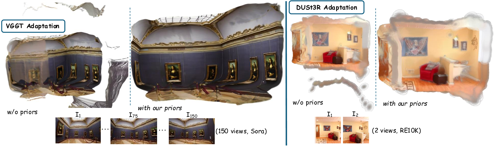

<p align="center">
  <h1 align="center">G<sup>3</sup>Splat</h1>
  <h3 align="center">Geometrically Consistent Generalizable Gaussian Splatting</h3>
 <p align="center">
    <a href="https://m80hz.github.io/" target="_blank">Mehdi Hosseinzadeh</a>
    &nbsp;&nbsp;&nbsp;&nbsp;
    <a href="https://sfchng.github.io/" target="_blank">Shin-Fang Chng</a>
    &nbsp;&nbsp;&nbsp;&nbsp;
    <a href="https://scholar.google.com/citations?user=ldanjkUAAAAJ&amp;hl=en" target="_blank">Yi Xu</a>
    &nbsp;&nbsp;&nbsp;&nbsp;
    <a href="https://researchers.adelaide.edu.au/profile/simon.lucey" target="_blank">Simon Lucey</a>
    &nbsp;&nbsp;&nbsp;&nbsp;
    <a href="https://scholar.google.com.au/citations?user=ATkNLcQAAAAJ&amp;hl=en" target="_blank">Ian Reid</a>
    &nbsp;&nbsp;&nbsp;&nbsp;
    <a href="https://researchers.adelaide.edu.au/profile/ravi.garg" target="_blank">Ravi Garg</a>
  </p>

  <p align="center">
    <a href="https://m80hz.github.io/g3splat" target="_blank">
      
    </a>
    &nbsp;
    <a href="https://arxiv.org/abs/2512.17547" target="_blank">
      
    </a>
    &nbsp;
    <a href="https://github.com/m80hz/g3splat" target="_blank">
      
    </a>
    &nbsp;
    <a href="https://huggingface.co/m80hz/g3splat" target="_blank">
      
    </a>
    &nbsp;
    <a href="#demo">
      
    </a>
  </p>
</p>

<p align="center">
<strong>G<sup>3</sup>Splat</strong> is a pose-free, self-supervised framework for generalizable Gaussian splatting that achieves state-of-the-art performance in geometry reconstruction, relative pose estimation, and novel-view synthesis.
</p>

<p align="center">
  
</p>

---

## ✨ Highlights

- 🎯 **Pose-Free**: No camera poses required at inference time
- 🔄 **Self-Supervised**: Trained without ground-truth depth or 3D supervision
- 🚀 **Feed-Forward**: Real-time inference with no per-scene optimization
- 📐 **Geometrically Consistent**: Alignment and orientation losses for accurate 3D reconstruction
- 🎨 **Flexible**: Supports both 3D Gaussian Splatting (3DGS) and 2D Gaussian Splatting (2DGS)

---

## 📋 Table of Contents

- [Installation](#installation)
- [Model Zoo](#model-zoo)
- [Demo](#demo)
- [Datasets](#datasets)
- [Evaluation](#evaluation)
  - [Depth Evaluation](#depth-evaluation)
  - [Pose Estimation](#pose-estimation)
  - [Novel View Synthesis](#novel-view-synthesis)
  - [Mesh Reconstruction](#mesh-reconstruction)
- [Training](#training)
- [Acknowledgements](#acknowledgements)
- [Citation](#citation)

---

## <a id="installation"></a>🛠️ Installation

Our implementation requires **Python 3.10+** and has been tested with PyTorch 2.1.2 and CUDA 11.8/12.1.

### 1. Clone the Repository

```bash
git clone https://github.com/m80hz/g3splat
cd g3splat
```

### 2. Create Environment and Install Dependencies

```bash
conda create -y -n g3splat python=3.10
conda activate g3splat
pip install torch==2.1.2 torchvision==0.16.2 torchaudio==2.1.2 --index-url https://download.pytorch.org/whl/cu118
pip install "numpy<2"  # Required: PyTorch 2.1.2 is incompatible with NumPy 2.x
pip install -r requirements.txt

# Install CUDA rasterizers 
pip install git+https://github.com/rmurai0610/diff-gaussian-rasterization-w-pose.git --no-build-isolation
pip install git+https://github.com/hbb1/diff-surfel-rasterization.git --no-build-isolation
```

### 3. (Optional) Compile CUDA Kernels for RoPE

For faster inference, compile the CUDA kernels for RoPE positional embeddings:

```bash
cd src/model/encoder/backbone/croco/curope/
python setup.py build_ext --inplace
cd ../../../../../..
```

---

## <a id="model-zoo"></a>🏆 Model Zoo

We provide pretrained checkpoints on [Hugging Face](https://huggingface.co/m80hz/g3splat) 🤗

### Available Models

| Model | Backbone | Gaussian Type | Training Data | Resolution | Download |
|:------|:--------:|:-------------:|:-------------:|:----------:|:--------:|
| G³Splat-3DGS | MASt3R | 3DGS | RealEstate10K | 256×256 | [📥 Download](https://huggingface.co/m80hz/g3splat/resolve/main/g3splat_mast3r_3dgs_align_orient_re10k.ckpt) |
| G³Splat-2DGS | MASt3R | 2DGS | RealEstate10K | 256×256 | [📥 Download](https://huggingface.co/m80hz/g3splat/resolve/main/g3splat_mast3r_2dgs_align_orient_re10k.ckpt) |

### 🔜 Coming Soon

| Model | Backbone | Gaussian Type | Status |
|:------|:--------:|:-------------:|:------:|
| G³Splat-VGGT-3DGS | VGGT | 3DGS | 🚧 Coming Soon |
> **Note**: The code and checkpoints for **G³Splat** with the [VGGT](https://github.com/facebookresearch/vggt) backbone will be released soon. Stay tuned for updates!

### Downloading Models

**Option 1: Direct Download**

Download from the links in the table above and place in `pretrained_weights/`.

**Option 2: Using Hugging Face Hub**

```bash
pip install huggingface_hub
```

```python
from huggingface_hub import hf_hub_download

# Download 3DGS model
hf_hub_download(
    repo_id="m80hz/g3splat",
    filename="g3splat_mast3r_3dgs_align_orient_re10k.ckpt",
    local_dir="pretrained_weights"
)

# Download 2DGS model
hf_hub_download(
    repo_id="m80hz/g3splat",
    filename="g3splat_mast3r_2dgs_align_orient_re10k.ckpt",
    local_dir="pretrained_weights"
)
```

**Option 3: Using Git LFS**

```bash
# Clone just the model files
git lfs install
git clone https://huggingface.co/m80hz/g3splat pretrained_weights
```

### Model Configuration

Expected directory structure:

```
pretrained_weights/
├── g3splat_mast3r_3dgs_align_orient_re10k.ckpt
└── g3splat_mast3r_2dgs_align_orient_re10k.ckpt 
```

> ⚠️ **Important**: When using **2DGS** models, you must set `gaussian_type: 2d` in the config:
> ```yaml
> # config/model/encoder/<backbone>.yaml  # e.g., noposplat.yaml, etc.
> # (<backbone> is a placeholder for the encoder backbone config you are using)
> gaussian_adapter:
>   gaussian_type: 2d   # Use '3d' for 3DGS models (default)
> ```
> Or pass it via command line: `model.encoder.gaussian_adapter.gaussian_type=2d`

---

## <a id="demo"></a>🎮 Demo

We provide an interactive web demo powered by [Gradio](https://gradio.app/) for visualizing G³Splat outputs.

> **Note**: The demo is intended for **quick visualization** and verifying that the installation works correctly. To reproduce the quantitative results reported in the paper, please refer to the [Evaluation](#evaluation) section.

### Quick Start

```bash
python demo.py --checkpoint pretrained_weights/g3splat_mast3r_3dgs_align_orient_re10k.ckpt
```

Then open your browser at `http://localhost:7860`

### Demo Features

- 📸 **Image Input**: Upload custom image pairs or use provided examples
- 🎯 **Pose-Free Inference**: No camera poses required
- 🖼️ **Novel View Synthesis**: Visualize rendered novel views with adjustable interpolation based on estimated poses
- 📊 **Geometry Visualization**: View depth maps, surface normals, and Gaussian normals
- 🌐 **Interactive 3D**: Explore Gaussian splats in the browser
- 💾 **Export**: Download PLY files for external visualization

### Command Line Options

```bash
python demo.py \
    --checkpoint <path_to_checkpoint> \
    --port 7860 \                  # Server port
    --share                        # Create public Gradio link
```

### Example Images

We provide example image pairs in `assets/examples/` organized by dataset:

```
assets/examples/
├── re10k_001/           # RealEstate10K scene
│   ├── context_0.png
│   └── context_1.png
├── re10k_002/
│   ├── context_0.png
│   └── context_1.png
├── scannet_001/         # ScanNet scene
│   ├── context_0.png
│   └── context_1.png
└── ...
```

Scene folders are named with a **dataset prefix** (e.g., `re10k_`, `scannet_`) followed by a number. The demo automatically detects the dataset and uses appropriate camera intrinsics.

---

## <a id="datasets"></a>📦 Datasets

G³Splat is trained on **RealEstate10K** and evaluated **zero-shot** on multiple benchmarks.

### Dataset Overview

| Dataset | Usage | Task | Download |
|:--------|:------|:-----|:--------:|
| [RealEstate10K](https://google.github.io/realestate10k/) | Training and Testing | NVS, Pose | [📥 Instructions](#realestate10k) |
| [ACID](https://infinite-nature.github.io/) | Zero-shot | NVS, Pose | [📥 Instructions](#acid) |
| [ScanNet](http://www.scan-net.org/) | Zero-shot | NVS, Pose, Depth, Mesh | [📥 Instructions](#scannet) |
| [NYU Depth V2](https://cs.nyu.edu/~fergus/datasets/nyu_depth_v2.html) | Zero-shot | Single-View Depth | [📥 Instructions](#nyudv2) |

### Expected Directory Structure

```
datasets/
├── re10k/
│   ├── train/
│   │   ├── 000000.torch
│   │   ├── ...
│   │   └── index.json
│   └── test/
│       ├── 000000.torch
│       ├── ...
│       └── index.json
├── acid/
│   ├── train/
│   │   ├── 000000.torch
│   │   ├── ...
│   │   └── index.json
│   └── test/
│       ├── 000000.torch
│       ├── ...
│       └── index.json
├── scannetv1_test/
│   ├── scene0664_00/
│   │   ├── color/
│   │   │    ├── 0.png
│   │   │    ...
│   │   ├── depth/
│   │   │    ├── 0.png
│   │   │    ...
│   │   ├── intrinsic/
│   │   │    ├── intrinsic_color.txt
│   │   │    └── intrinsic_depth.txt
│   │   ├── pose/
│   │   │    ├── 0.txt
│   │   │    ...
│   │   └── mesh/
│   │        └── scene0664_00_vh_clean_2.ply
│   ├── ...
│   └── scannet_test_pairs.txt
└── nyud_test/
    ├── color/
    │   └── 0001.png
    │    ...
    └── depth/
    │   └── 0001.png
    │    ...
    └── intrinsic_color.txt

```

> **Note**: By default, datasets are expected in `datasets/`. Override with:
> ```bash
> dataset.DATASET_NAME.roots=[/your/path]
> ```

### Dataset Preparation

<details>
<summary><b id="realestate10k">📁 RealEstate10K (Training)</b></summary>

We follow [pixelSplat](https://github.com/dcharatan/pixelsplat)'s data processing pipeline. See the [pixelSplat dataset guide](https://github.com/dcharatan/pixelsplat?tab=readme-ov-file#acquiring-datasets) for instructions on downloading and processing the dataset (use the **360p version**, recommended for **256×256** training). You can also download the preprocessed dataset directly from the same page.


</details>

<details>
<summary><b id="acid">📁 ACID (Zero-shot Evaluation)</b></summary>

Visit the [ACID Dataset Page](https://infinite-nature.github.io/) to download the raw data, then convert the dataset by following the instructions in the [pixelSplat dataset guide](https://github.com/dcharatan/pixelsplat?tab=readme-ov-file#acquiring-datasets). Alternatively, you can download the preprocessed version directly from the same guide.

</details>

<details>
<summary><b id="scannet">📁 ScanNet (Zero-shot Evaluation)</b></summary>

1. **Request Access**: Visit the [ScanNet official page](http://www.scan-net.org/) and request access to the dataset.

2. **Download Data**: Once approved, download the **ScanNet v1 test set**, including color images, depth maps, camera poses, and mesh reconstructions. Use `scripts/download_scannet_v1_test_meshes.sh` to download the mesh files.

3. **Test Pairs**: Download the test split file [scannet_test_pairs.txt](https://drive.google.com/file/d/1uOkJZ6MfY8wrt6CzaNap9l-7UobWN2x-/view?usp=sharing), which defines the image pairs for test scenes and context views.

</details>

<details>
<summary><b id="nyudv2">📁 NYU Depth V2 (Zero-shot Single-View Depth)</b></summary>

1. **Visit the official dataset page**: Go to the [NYU Depth V2 Dataset](https://cs.nyu.edu/~fergus/datasets/nyu_depth_v2.html) website.

2. **Download the data**: Follow the instructions on the page to obtain the dataset files you need.

3. **(Optional) Use the preprocessed test set**: Download the preprocessed test split here: [nyud_test](https://drive.google.com/file/d/1je9X8fU5Vq6GYcK8Y-St-g1mx6lIgGPf/view?usp=sharing).

</details>

---

## <a id="evaluation"></a> Evaluation

### Depth Evaluation

#### Multi-View Depth

<details open>
<summary><b>ScanNet (Zero-shot)</b></summary>

```bash
python -m src.eval_depth +experiment=scannet_depth_align_orient +evaluation=eval_depth \
    checkpointing.load=pretrained_weights/g3splat_mast3r_3dgs_align_orient_re10k.ckpt
```

</details>

#### Single-View Depth

<details>
<summary><b>NYU Depth V2 (Zero-shot)</b></summary>

```bash
python -m src.eval_depth +experiment=nyud_depth_align_orient +evaluation=eval_depth \
    checkpointing.load=pretrained_weights/g3splat_mast3r_3dgs_align_orient_re10k.ckpt
```

</details>

> **💡 Tip**: Add `evaluation.use_pose_refinement=false` to disable test-time pose refinement.

**Metrics**: AbsRel ↓ | δ<1.10 ↑ | δ<1.25 ↑

---

### Pose Estimation

Evaluate relative camera pose estimation:

<details open>
<summary><b>RealEstate10K</b></summary>

```bash
python -m src.eval_pose +experiment=re10k_align_orient +evaluation=eval_pose \
    dataset/view_sampler@dataset.re10k.view_sampler=evaluation \
    dataset.re10k.view_sampler.index_path=assets/evaluation_index_re10k.json \
    checkpointing.load=pretrained_weights/g3splat_mast3r_3dgs_align_orient_re10k.ckpt
```

</details>

<details>
<summary><b>ACID (Zero-shot)</b></summary>

```bash
python -m src.eval_pose +experiment=acid_align_orient +evaluation=eval_pose \
    dataset/view_sampler@dataset.re10k.view_sampler=evaluation \
    dataset.re10k.view_sampler.index_path=assets/evaluation_index_acid.json \
    checkpointing.load=pretrained_weights/g3splat_mast3r_3dgs_align_orient_re10k.ckpt
```

</details>

<details>
<summary><b>ScanNet (Zero-shot)</b></summary>

```bash
python -m src.eval_pose +experiment=scannet_pose_align_orient +evaluation=eval_pose \
    checkpointing.load=pretrained_weights/g3splat_mast3r_3dgs_align_orient_re10k.ckpt
```

</details>

> **💡 Tip**: Add `evaluation.use_pose_refinement=false` to disable test-time pose refinement.

**Metrics**: Rotation Error (°) ↓ | Translation Error (°) ↓ | AUC@5° ↑ | AUC@10° ↑ | AUC@20° ↑ | AUC@30° ↑

---

### Novel View Synthesis

<details open>
<summary><b>RealEstate10K</b></summary>

```bash
python -m src.main +experiment=re10k_align_orient_1x8 mode=test \
    dataset/view_sampler@dataset.re10k.view_sampler=evaluation \
    dataset.re10k.view_sampler.index_path=assets/evaluation_index_re10k.json \
    checkpointing.load=pretrained_weights/g3splat_mast3r_3dgs_align_orient_re10k.ckpt
```

</details>

<details>
<summary><b>ACID (Zero-shot)</b></summary>

```bash
python -m src.main +experiment=acid_align_orient_1x8 mode=test \
    dataset/view_sampler@dataset.re10k.view_sampler=evaluation \
    dataset.re10k.view_sampler.index_path=assets/evaluation_index_acid.json \
    checkpointing.load=pretrained_weights/g3splat_mast3r_3dgs_align_orient_re10k.ckpt
```

</details>

<details>
<summary><b>ScanNet (Zero-shot)</b></summary>

```bash
python -m src.main +experiment=scannet_depth_align_orient mode=test \
    checkpointing.load=pretrained_weights/g3splat_mast3r_3dgs_align_orient_re10k.ckpt
```

</details>

> **💡 Tip**: Set `test.save_image=true` and/or `test.save_video=true` to save rendered images and videos to the directory specified by `test.output_path`.


**Metrics**: PSNR ↑ | SSIM ↑ | LPIPS ↓

---

### Mesh Evaluation

Evaluate 3D mesh reconstructions on ScanNet:

```bash
python -m src.eval_mesh +experiment=scannet_depth_align_orient +evaluation=eval_mesh \
    checkpointing.load=pretrained_weights/g3splat_mast3r_3dgs_align_orient_re10k.ckpt
```

**Metrics**: Accuracy ↓ | Completeness ↓ | Overall (Chamfer Distance) ↓ 

---

### Export Gaussian PLY:

```bash
python -m src.main +experiment=re10k_align_orient_1x8 mode=test \
    dataset/view_sampler@dataset.re10k.view_sampler=evaluation \
    dataset.re10k.view_sampler.index_path=assets/evaluation_index_re10k.json \
    checkpointing.load=pretrained_weights/g3splat_mast3r_3dgs_align_orient_re10k.ckpt \
    test.save_gaussian=true 
```

---

### Evaluation Quick Reference

| Task | Dataset | Script | Experiment Config |
|:-----|:--------|:-------|:------------------|
| Depth | ScanNet | `src.eval_depth` | `scannet_depth_align_orient` |
| Depth | NYU Depth V2 | `src.eval_depth` | `nyud_depth_align_orient` |
| Pose | RE10K | `src.eval_pose` | `re10k_align_orient` |
| Pose | ACID | `src.eval_pose` | `acid_align_orient` |
| Pose | ScanNet | `src.eval_pose` | `scannet_pose_align_orient` |
| NVS | RE10K | `src.main` | `re10k_align_orient_1x8` |
| NVS | ACID | `src.main` | `acid_align_orient_1x8` |
| NVS | ScanNet | `src.main` | `scannet_depth_align_orient` |
| Mesh | ScanNet | `src.eval_mesh` | `scannet_depth_align_orient` |

> **📜 Batch Evaluation**: See [`scripts/eval_checkpoint.sh`](scripts/eval_checkpoint.sh) and [`scripts/all_evals.sh`](scripts/all_evals.sh) for unified scripts to run multiple evaluations.

---

## <a id="training"></a> Training

### Prerequisites

Download the [MASt3R](https://download.europe.naverlabs.com/ComputerVision/MASt3R/MASt3R_ViTLarge_BaseDecoder_512_catmlpdpt_metric.pth) pretrained weights:

```bash
mkdir -p pretrained_weights
wget -P pretrained_weights/ https://download.europe.naverlabs.com/ComputerVision/MASt3R/MASt3R_ViTLarge_BaseDecoder_512_catmlpdpt_metric.pth
```

### Training Commands

<details open>
<summary><b>Multi-GPU Training (Recommended)</b></summary>

```bash
# 24× A100 GPUs (6 nodes × 4 GPUs), effective batch size 144
python -m src.main +experiment=re10k_align_orient \
    wandb.mode=online \
    wandb.name=g3splat_align_orient
```

**Training Time**: ~6 hours on 24× A100 (40GB)

**SLURM Cluster**: See [`slurm_train.sh`](slurm_train.sh) for an example job script.

</details>

<details>
<summary><b>Single-GPU Training</b></summary>

```bash
# Single A6000 (48GB), batch size 8
python -m src.main +experiment=re10k_align_orient_1x8 \
    wandb.mode=online \
    wandb.name=g3splat_align_orient_1x8
```

**Training Time**: ~120 hours on 1× A6000

</details>

<details>
<summary><b>Training 2DGS Variant</b></summary>

```bash
python -m src.main +experiment=re10k_align_orient \
    model.encoder.gaussian_adapter.gaussian_type=2d \
    wandb.mode=online \
    wandb.name=g3splat_2dgs_align_orient
```

</details>

### Training Configurations

| Config | Hardware | Batch Size | Training Time |
|:-------|:---------|:----------:|:-------------:|
| `re10k_align_orient` | 24× A100 | 144 | ~6 hours |
| `re10k_align_orient_1x8` | 1× A6000 | 8 | ~120 hours |
| `re10k_align` | 24× A100 | 144 | ~6 hours |
| `re10k_orient` | 24× A100 | 144 | ~6 hours |

> **💡 Tip**: When changing batch size, adjust learning rate and training steps proportionally for optimal convergence.

---

## <a id="acknowledgements"></a> Acknowledgements

This project is developed with several repositories: [VGGT](https://github.com/facebookresearch/vggt), [NoPoSplat](https://github.com/cvg/NoPoSplat), [MASt3R](https://github.com/naver/mast3r), [DUSt3R](https://github.com/naver/dust3r), [pixelSplat](https://github.com/dcharatan/pixelsplat), and [CUT3R](https://github.com/CUT3R/CUT3R). We thank all the authors for their contributions to the community.

---

## <a id="citation"></a> Citation

If you find G³Splat useful in your research, please consider citing:

```bibtex
@inproceedings{g3splat,
  title     = {G3Splat: Geometrically Consistent Generalizable Gaussian Splatting},
  author    = {Hosseinzadeh, Mehdi and Chng, Shin-Fang and Xu, Yi and Lucey, Simon and Reid, Ian and Garg, Ravi},
  booktitle = {arXiv:2512.17547},
  year      = {2025},
  url       = {https://arxiv.org/abs/2512.17547}
}
```

---

<p align="center">
  <b>⭐ Star us on GitHub if you find this project useful! ⭐</b>
  <br><br>
  <i>Questions? Feel free to <a href="https://github.com/m80hz/g3splat/issues">open an issue</a> or reach out!</i>
</p>
